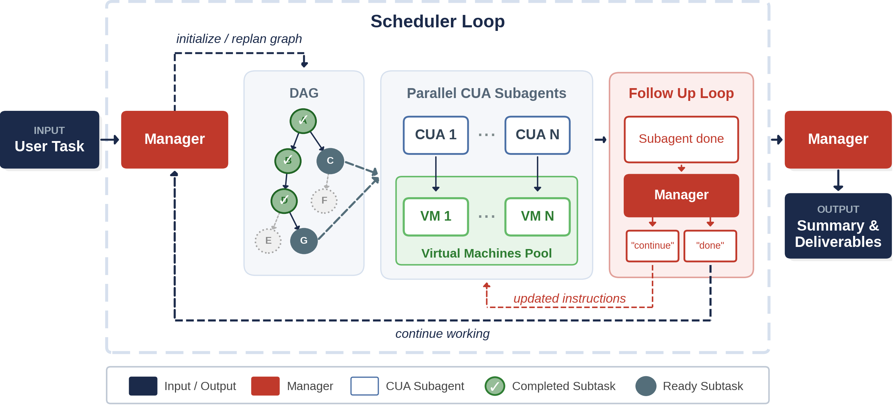

# Multi-Agent Computer Use (MACU)

This is the code repository for the Multi-Agent Computer Use paper. We propose and implement a general multi-agent computer use (MACU) setup. A manager LLM decomposes computer-use tasks into a directed acyclic graph of subtasks, dispatches parallel CUA subagents, and continuously revises the DAG as new findings arrive.

MACU improves over single-agent CUAs by 4.7 - 25.5% across three benchmarks, and achieves 1.5x faster wall-clock time on long-horizon tasks.

[Project website](https://jykoh.com/multi-agent-computer-use/) | [arXiv paper](https://arxiv.org/abs/2606.01533)



## Example MACU Run

<p align="center">
  
</p>

## Project Structure

```
multi-agent-computer-use/
|-- run_macu.py              # MACU CLI entrypoint
|-- prompts/                 # Manager prompts for graph generation, replanning, followup, and aggregation
|-- scripts/                 # CUA runner and replay/backfill utilities
|-- evals/                   # Offline evaluators for completed run directories
|-- utils/                   # Runtime, graph, manager, VM, file, and benchmark helpers
|-- osworld/                 # Local OSWorld patches and agent shims
|-- tests/                   # Unit tests and small graph fixtures
|-- requirements.txt
`-- README.md
```

## Setup

Requires Python 3.12 for the OSWorld/torch stack. You also need an OSWorld checkout and a configured VM provider (we support `vmware` and `apptainer` (QEMU)) for real CUA runs.

```bash
uv venv --python python3.12 .venv
source .venv/bin/activate
uv pip install -r requirements.txt
```

### OSWorld Checkout

Clone [OSWorld](https://github.com/xlang-ai/OSWorld/) locally and follow their setup instructions to install the virtual machines. Please also install its dependencies into the same `.venv` created above, and pass that checkout to MACU when running OSWorld-backed tasks:

```bash
git clone https://github.com/xlang-ai/OSWorld ../OSWorld
# TODO: Follow the setup instructions to install OSWorld virtual envs
export OSWORLD_ROOT="$(realpath ../OSWorld)"
uv pip install -r "$OSWORLD_ROOT/requirements.txt" -r requirements.txt
```

Use `--osworld-root "$OSWORLD_ROOT"` and `--osworld-data-dir "$OSWORLD_ROOT/evaluation_examples"` in `run_macu.py` commands so the runner can import OSWorld and resolve its task JSON files.

### Online-Mind2Web Data

Online-Mind2Web runs use the same OSWorld-backed CUA runner. Download the task file from Hugging Face into the local `data/online_m2w/` directory:

```bash
mkdir -p data/online_m2w
curl -L \
  -o data/online_m2w/Online_Mind2Web.json \
  https://huggingface.co/datasets/osunlp/Online-Mind2Web/resolve/main/Online_Mind2Web.json
```

### Odysseys Data

Download the Odysseys task file into the local `data/odysseys/` directory:

```bash
mkdir -p data/odysseys
curl -L \
  -o data/odysseys/odysseys.json \
  https://raw.githubusercontent.com/ljang0/Odysseys/main/data/odysseys.json
```

### API Keys

Copy `.example_env` to a local `.env`, replace the dummy values, then export them before launching MACU:

```bash
cp .example_env .env
set -a
source .env
set +a
```

## Quick Start

Start a vLLM server for the Qwen CUA subagents first:

```bash
vllm serve Qwen/Qwen3.6-27B \
  --host 127.0.0.1 --port 8000 \
  --tensor-parallel-size 2 \
  --mm-encoder-tp-mode data \
  --mm-processor-cache-type shm \
  --reasoning-parser qwen3 \
  --enable-auto-tool-choice \
  --tool-call-parser qwen3_coder \
  --attention-backend FLASH_ATTN \
  --enable-prefix-caching \
  --max-model-len 65536 \
  --max-num-seqs 8 \
  --data-parallel-size 1 \
  --performance-mode interactivity \
  --mamba-block-size 8
```

Then point the Qwen CUA provider at the OpenAI-compatible vLLM endpoint:

```bash
export OPENAI_BASE_URL=http://127.0.0.1:8000/v1
```

```bash
source .venv/bin/activate
set -a && source .env && set +a

python run_macu.py data/osworld/evaluation_examples/test_small.json \
  --result-dir runs/osworld_test_small_qwen \
  --osworld-root "$OSWORLD_ROOT" \
  --osworld-data-dir "$OSWORLD_ROOT/evaluation_examples" \
  --manager-provider anthropic --manager-model claude-opus-4-6 \
  --cua-provider qwen \
  --max-parallelism 4 \
  -- --headless --provider_name vmware \
     --model Qwen/Qwen3.6-27B --max_steps 60 --sleep_after_execution 5.0
```

To run Online-Mind2Web or Odysseys directly with `run_macu.py`, use the same command and replace only the input JSON and result directory:

| Benchmark | Input JSON | Suggested `--result-dir` |
| --- | --- | --- |
| Online-Mind2Web | `data/online_m2w/Online_Mind2Web.json` | `runs/online_m2w_macu` |
| Odysseys | `data/odysseys/odysseys.json` | `runs/odysseys_macu` |

To use GPT-5.4-mini as the CUA subagent instead of vLLM-backed Qwen, switch the CUA provider and model:

```bash
python run_macu.py data/osworld/evaluation_examples/test_small.json \
  --result-dir runs/osworld_test_small_gpt54mini \
  --osworld-root "$OSWORLD_ROOT" \
  --osworld-data-dir "$OSWORLD_ROOT/evaluation_examples" \
  --manager-provider anthropic --manager-model claude-opus-4-6 \
  --cua-provider openai \
  --max-parallelism 4 \
  -- --headless --provider_name vmware \
     --model gpt-5.4-mini --max_steps 60 --sleep_after_execution 5.0
```

Use `--task-id <id>` to run one task from a larger task file. OSWorld runs call the OSWorld evaluator at the end.

### Output Layout

Each task writes a directory under the selected result root:

```
runs/<task_id>/
|-- dependency_graph.json
|-- graph_snapshots/
|-- replan_log.jsonl
|-- summary.json
|-- final_results.json
|-- final_traj/
|-- manager_prompt_*.yaml
|-- manager_response_*.yaml
|-- <subtask_id>/
|   |-- task.json
|   |-- meta.json
|   |-- subprocess.log
|   `-- vm_info.json
`-- <aggregation_id>/
    `-- manager_response.txt
```

### CUA Subagents

We have implemented several models to use as CUA subagents (more to come!):

| Provider | Agent | Typical model | Notes |
| --- | --- | --- | --- |
| `openai` | GPT-5.4 CUA | `gpt-5.4-mini` or `gpt-5.4` | Uses `OPENAI_API_KEY` |
| `qwen` | Qwen CUA via OpenAI-compatible vLLM | `Qwen/Qwen3.6-27B` | Uses `OPENAI_BASE_URL`; `OPENAI_API_KEY` can be a dummy value for local vLLM |

Manager providers are selected with `--manager-provider {anthropic,openai,google,huggingface}` and `--manager-model`.

## Evaluation

OSWorld task scores are written directly into each task's `final_results.json` when the run completes.

Online-Mind2Web-style web runs can be judged with WebJudge:

```bash
.venv/bin/python evals/webjudge_eval.py \
  --run-dir runs/online_mind2web_macu \
  --judge-model o4-mini \
  --max-parallel 32
```

Odysseys-style runs can be judged per rubric:

```bash
.venv/bin/python evals/odysseys_eval.py \
  --runs-dir runs/odysseys_macu \
  --task-source-json data/odysseys/tasks.json \
  --model gemini-3.1-flash-lite-preview \
  --num-workers 16 \
  --max-concurrent-rubrics 4
```

### Benchmark Results

We achieved the following results, as described in more detail in our [paper](https://arxiv.org/abs/2606.01533):

<table>
  <thead>
    <tr>
      <th rowspan="2">Benchmark</th>
      <th colspan="2">Single Agent</th>
      <th colspan="2">MACU</th>
      <th colspan="2">Delta</th>
    </tr>
    <tr>
      <th>SR (%)</th>
      <th>Wall-clock (min)</th>
      <th>SR (%)</th>
      <th>Wall-clock (min)</th>
      <th>SR (pts)</th>
      <th>Wall-clock (min)</th>
    </tr>
  </thead>
  <tbody>
    <tr>
      <td>OSWorld</td>
      <td>43.8</td>
      <td>26.6</td>
      <td>48.6</td>
      <td>21.4</td>
      <td>+4.7</td>
      <td>-5.2</td>
    </tr>
    <tr>
      <td>Online-Mind2Web</td>
      <td>50.7</td>
      <td>18.5</td>
      <td>56.5</td>
      <td>33.6</td>
      <td>+5.8</td>
      <td>+15.1</td>
    </tr>
    <tr>
      <td>Odysseys</td>
      <td>8.5</td>
      <td>162.4</td>
      <td>34.0</td>
      <td>110.3</td>
      <td>+25.5</td>
      <td>-52.1</td>
    </tr>
  </tbody>
</table>

## Run MACU on Your Task

Use `--task` to run any ad hoc instruction with MACU. The runner writes a one-item task file under `--result-dir/_input_tasks/`. First verify that a VMware VM can boot and register it in the OSWorld pool. Use `-T fusion` instead of `-T ws` on macOS:

```bash
export OSWORLD_ROOT="$(realpath ../OSWorld)"
export MACU_VM_PATH="/absolute/path/to/Ubuntu.vmx"

vmrun -T ws revertToSnapshot "$MACU_VM_PATH" init_state
vmrun -T ws start "$MACU_VM_PATH" nogui
vmrun -T ws stop "$MACU_VM_PATH" hard
printf '%s|free\n' "$MACU_VM_PATH" > "$OSWORLD_ROOT/.vmware_vms"
```

The stop leaves the VM available for `run_macu.py`; the first CUA worker claims it from `.vmware_vms` and starts it again.

Then source credentials and launch MACU on the raw task string:

```bash
source .venv/bin/activate
set -a
source .env
set +a

python run_macu.py \
  --task "Find 3 cafes near Carnegie Mellon University and list 3 interesting items on the menu of each" \
  --task-id cafes_near_cmu \
  --result-dir runs/cafes_near_cmu \
  --osworld-root "$OSWORLD_ROOT" \
  --manager-provider anthropic --manager-model claude-opus-4-6 \
  --cua-provider openai \
  --max-parallelism 3 \
  -- --headless --provider_name vmware \
     --model gpt-5.4-mini --max_steps 100 \
     --sleep_after_execution 3.0 --env_ready_wait_seconds 60
```

For local Qwen CUA workers, keep the vLLM server from the Quick Start running, export `OPENAI_BASE_URL=http://127.0.0.1:8000/v1`, and switch the command to `--cua-provider qwen` plus `--model Qwen/Qwen3.6-27B` (or whatever Qwen model you are hosting locally).

### Visualize a Completed Run

After a run finishes, build a self-contained HTML viewer for it with `scripts/visualize_run.py`. It mirrors the animated player on the project homepage: a gantt chart with playback controls and replan markers, a live DAG that updates as subagents finish, per-subagent screenshot strips with the model's reasoning + action, and the aggregator's final response.

```bash
python scripts/visualize_run.py runs/cafes_near_cmu
```

This writes everything to `runs/cafes_near_cmu/visualization/`. Open `runs/cafes_near_cmu/visualization/index.html` in any browser — CSS, JS, and the run JSON are inlined into the HTML, so it works directly via `file://` with no local server required (only the screenshots live as separate files alongside it).

Useful flags:

- `--output-dir DIR` — write the viewer somewhere other than `<run_dir>/visualization`
- `--max-frames N` — cap keyframes per subtask (default 16); bump higher for very long subtasks


## Citation

```bibtex
@article{koh2026multiagentcomputeruse,
  title={Multi-Agent Computer Use},
  author={Koh, Jing Yu and Salakhutdinov, Ruslan and Fried, Daniel},
  journal={arXiv preprint arXiv:2606.01533},
  year={2026}
}
```

## Acknowledgements

Our CUA subagent implementations were based off the official [OSWorld](https://github.com/xlang-ai/OSWorld/tree/main) implementations. Our evaluation scripts were directly lifted from the official [Online-Mind2Web](https://github.com/OSU-NLP-Group/Online-Mind2Web), [WebTailBench](https://github.com/microsoft/fara/blob/main/webeval/src/webeval/benchmarks/webtailbench/webtailbench.py) and [Odysseys](https://github.com/ljang0/Odysseys/) repositories.
